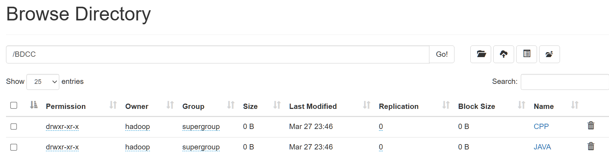

# 📂 HDFS File System Manipulation

This project focuses on practicing HDFS (Hadoop Distributed File System) operations, including directory creation, file manipulation, and content management.

---

## 📌 Table of Contents
1. [Project Overview](#project-overview)
2. [HDFS Commands and Execution](#hdfs-commands-and-execution)
   - [🛠️ Create Directory Structure](#1-create-directory-structure)
   - [📝 Create and Append Content to Files](#2-create-and-append-content-to-files)
   - [📖 Display File Contents](#3-display-file-contents)
   - [📂 Copy Files to Another Directory](#4-copy-files-to-another-directory)
   - [🗑️ Delete and Rename Files](#5-delete-and-rename-files)
   - [💻 Create Local Directory and Files](#6-create-local-directory-and-files)
   - [📥 Copy Files to HDFS](#7-copy-files-to-hdfs)
   - [📜 Recursive Listing of Directory](#8-recursive-listing-of-directory)
   - [🚮 Delete Files and Directory](#9-delete-files-and-directory)
3. [🔍 Conclusion](#conclusion)

---

## 📌 Project Overview
This project covers fundamental HDFS operations, including:

✅ Creating directories and files

✅ Writing and reading content

✅ Copying, renaming, and deleting files

✅ Moving files between local storage and HDFS

---

## 🔹 HDFS Commands and Execution

### 1️⃣ Create Directory Structure
```sh
hdfs dfs -mkdir -p /BDCC/{JAVA/{TPS,Cours}, CPP/{TPs, Cours}}
```




### 2️⃣ Create and Append Content to Files
```sh
hdfs dfs -touchz /BDCC/CPP/Cours/{CoursCPP1,CoursCPP2,CoursCPP3}
```
```sh
hdfs dfs -appendToFile - /BDCC/CPP/Cours/CoursCPP1
```

```sh
hdfs dfs -appendToFile - /BDCC/CPP/Cours/CoursCPP2
```

```sh
hdfs dfs -appendToFile - /BDCC/CPP/Cours/CoursCPP3
```


### 3️⃣ Display File Contents
```sh
hdfs dfs -cat /BDCC/CPP/Cours/CoursCPP1
```

```sh
hdfs dfs -cat /BDCC/CPP/Cours/CoursCPP2
```

```sh
hdfs dfs -cat /BDCC/CPP/Cours/CoursCPP3
```


### 4️⃣ Copy Files to Another Directory
```sh
hdfs dfs -cp /BDCC/CPP/Cours/* /BDCC/JAVA/Cours
```


### 5️⃣ Delete and Rename Files
```sh
hdfs dfs -rm /BDCC/JAVA/Cours/CoursCPP3
```


```sh
hdfs dfs -mv /BDCC/JAVA/Cours/CoursCPP1 /BDCC/JAVA/Cours/CoursJAVA1
hdfs dfs -mv /BDCC/JAVA/Cours/CoursCPP2 /BDCC/JAVA/Cours/CoursJAVA2
```


### 6️⃣ Create Local Directory and Files
```sh
mkdir tps
cd tps
touch TP1CPP 
touch TP2CPP 
touch TP1JAVA 
touch TP2JAVA 
touch TP3JAVA
```

### 7️⃣ Copy Files to HDFS
```sh
hdfs dfs -put TP1CPP /BDCC/CPP/TPs
hdfs dfs -put TP2CPP /BDCC/CPP/TPs
hdfs dfs -put TP1JAVA /BDCC/JAVA/TPS
hdfs dfs -put TP2JAVA /BDCC/JAVA/TPS
hdfs dfs -put TP3JAVA /BDCC/JAVA/TPS
```


### 8️⃣ Recursive Listing of Directory
```sh
hdfs dfs -ls -R /
```


### 9️⃣ Delete Files and Directory
```sh
hdfs dfs -rm /BDCC/CPP/TPs/TP1CPP
```

```sh
hdfs dfs -rm -r /BDCC/JAVA
```


---

## 🔍 Conclusion
This project showcases key HDFS operations required for efficient file and directory management in a Hadoop environment. Mastering these commands will help streamline data processing and organization within a distributed system.

---
🎯 **Next Steps:** Try adding more complex HDFS operations, such as file permissions, quotas, or replication management!

🚀 Happy Coding!

